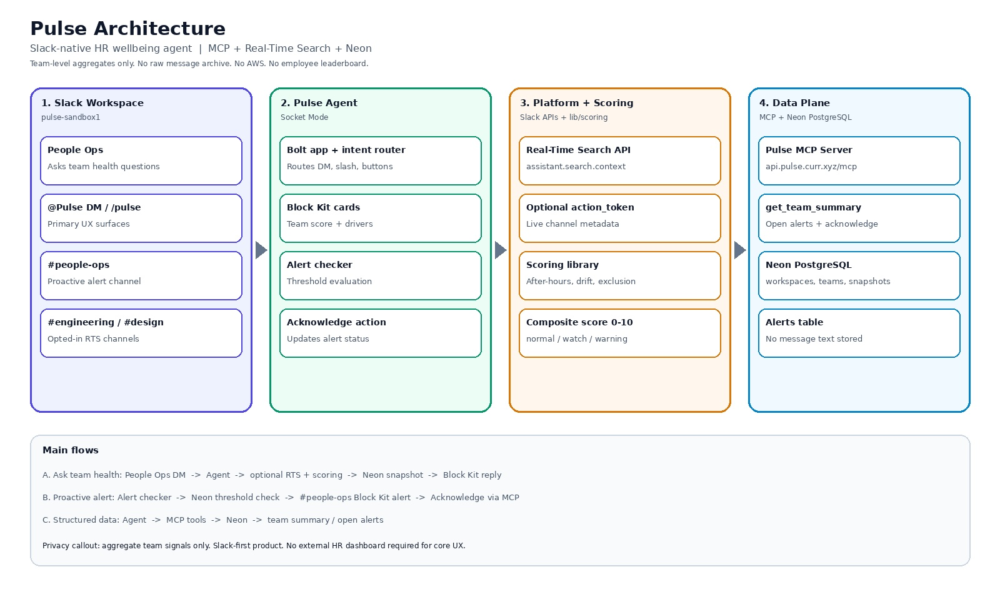

# Pulse

**Team health pulse checks, not surveillance.**

Slack-native HR wellbeing agent for the **Slack Agent for Good** hackathon.


|                   |                      |
| ----------------- | -------------------- |
| **Bot**           | `@Pulse`             |
| **Slash command** | `/pulse`             |
| **Sandbox**       | `pulse-sandbox1`     |
| **Track**         | Slack Agent for Good |


---

## For judges (start here)

**Workspace:** [pulse-sandbox1](https://pulse-sandbox1.enterprise.slack.com) — invites: `slackhack@salesforce.com`, `testing@devpost.com`

### 60-second test

1. DM `**@Pulse`**: `How is Engineering doing this week?`
2. Expect a **Block Kit card** — Engineering, Watch, score ~4.8, signal drivers.
3. Open `**#people-ops`** → run `/pulse check-alerts` if no alerts visible.
4. Click **Acknowledge** on an alert card → thread confirmation.

### What Pulse does

- **Team-level** wellbeing signals (not per-employee rankings)
- **MCP** tools backed by **Neon PostgreSQL** (snapshots + alerts)
- **Real-Time Search** for optional live refresh from `#engineering` / `#design` (metadata only)
- **Proactive alerts** to `#people-ops` when teams cross thresholds

### Demo channels (pulse-sandbox1)


| Channel        | Purpose                         |
| -------------- | ------------------------------- |
| `#people-ops`  | Proactive HR alerts             |
| `#engineering` | Engineering team / RTS opted-in |
| `#design`      | Design team / RTS opted-in      |


> **Note:** Team scores in the demo use **seeded snapshots** in Neon for reliability. RTS may update Engineering/Design when live channel data is returned. No Slack message text is stored in the database.

### Architecture



---

## For developers

### Stack

- Slack Agent (Bolt + OpenAI Agents SDK) — `pulse-agent/`
- Pulse MCP server — `mcp/`
- Neon PostgreSQL + Drizzle — `lib/db/`
- Team scoring — `lib/scoring/`
- RTS + proactive worker — `lib/rts/`, `lib/worker/`

### Local setup

```bash
cp .env.example .env

npm install
npm run db:push
npm run db:seed    # demo team snapshots only — no messages

# Terminal 1 (optional — LLM/MCP path)
npm run mcp:start

# Terminal 2
cd pulse-agent && npm install && slack run
```

### MCP tools


| Tool                                          | Use                             |
| --------------------------------------------- | ------------------------------- |
| `get_team_summary(team)`                      | Team health snapshot            |
| `get_open_alerts()`                           | Open HR alerts                  |
| `acknowledge_alert(alert_id, actor_slack_id)` | Acknowledge alert               |
| `record_signal_snapshot`                      | Store aggregates after RTS pass |


### Slash commands


| Command               | Description                             |
| --------------------- | --------------------------------------- |
| `/pulse health`       | Workspace team summary                  |
| `/pulse check-alerts` | Threshold check + post to `#people-ops` |
| `/pulse help`         | Intro card                              |


### Scripts

```bash
npm run mcp:test          
npm run scoring:demo      # offline metadata scoring
npm run worker:check      # alert threshold check 
npm run worker:start      # cron HTTP server (port 3200)
```

### Privacy model

- Aggregate team scores in `signal_snapshots` only
- No `messages` or message text tables
- RTS processes metadata in memory; optional small OpenRouter sample not persisted
- No employee leaderboard

---

## License

MIT (see `pulse-agent/package.json`)